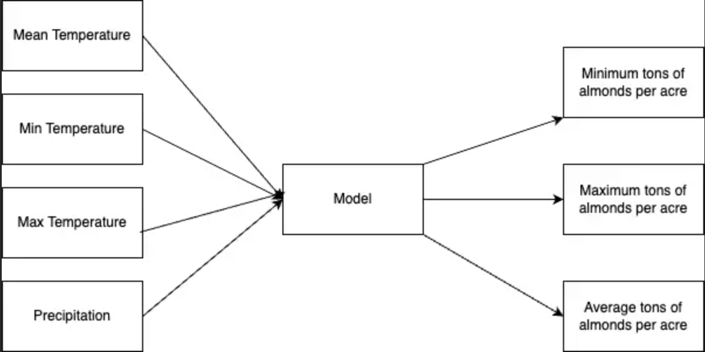

```{r}
#setting up our knitr options
knitr::opts_chunk$set(echo = TRUE, warning = FALSE, message = FALSE,
                      tidy.opts = list(width.cutoff = 60), tidy = TRUE)
```

```{r, results="hide"}
library(tidyverse)
library(janitor)
library(kableExtra)
```

This is the almond equation that we need to create the function for:

Y = -0.0157T~n,2~ - 0.0046(T~n,2~)\^2 - 0.07P~1~ + 0.0043(P~1~)\^2 + 0.28

where:

Y = yield (tons of almonds per acre)

T = temperatures,where subscript numbers denote month of climate variable(Celsius)

P = average daily precipitation (mm)

This is our conceptual model:

{width="90%"}

## Reading in Data

reading in climate data, by:

-    setting up our working direction

-    reading in data

-   display data head

```{r}
# Set your working directory to your home path first
setwd(here::here())


# Read in the climate data
clim_data <- read.table("clim.txt", header = TRUE)

# Display the first few rows of the dataframe
kable(head(clim_data), "pipe")
```

## Preprocessing

We actually have two functions:

-    `calculate_climate_statistics`

-   `calculate_almond_yield`

however `calculate_climate_statistics` serves as a pre-processing tool, so we will include that below as part of our data calculation. We will instead source `calculate_almost_yield`from our almond_yield.R script

```{r}
#-------------------------
# PREPROCESSING FUNCTION
#-------------------------

# Generate your statistics, with the conceptual model we drew in mind:
calculate_climate_statistics <- function(DATA) {
 
  # Calculate the minimum and maximum temperature, and total precipitation for each month of each year
  stats <- list(
    MinTemp = aggregate(tmin_c ~ year + month, data = DATA, FUN = min, na.rm = TRUE),
    MaxTemp = aggregate(tmax_c ~ year + month, data = DATA, FUN = max, na.rm = TRUE),
    TotalPrecip = aggregate(precip ~ year + month, data = DATA, FUN = sum, na.rm = TRUE)
  )
  
  # Merge the individual statistics dataframes into one
  climate_stats_df <- Reduce(function(...) merge(..., by = c("year", "month"), all = TRUE), stats)
  
  # Sort the data frame by year and month
  climate_stats_df <- climate_stats_df[order(climate_stats_df$year, climate_stats_df$month), ]
  
  return(climate_stats_df) 
} #END FUNCTION

#-------------------------------
# RUNNING PRE-PROCESSING FUNCTION
#-------------------------------

# Create dataframe with stats
climate_stats_df <- calculate_climate_statistics(clim_data)


```

## Using Function and Final Calculations

we will finally source our function within the same working directory. For our script, we calculated our almond yield. after running our yield, we calculate the mean, max, and min of our yield

```{r}
#--------------
#   SOURCING
#--------------
source("almond_yield.R")


#--------------
#   FUNCTION
#--------------
#save as dataframe USING FUNCTION
almond_yield_df <- calculate_almond_yield(clim_data)


#------------------
#  Mean, Max, Min
#------------------
#find mean yield
mean_almond_yield <- mean(almond_yield_df$almond_yield, na.rm = TRUE)

#Find the max and min yields
max_almond_yield <- max(almond_yield_df$almond_yield, na.rm = TRUE)
min_almond_yield <- min(almond_yield_df$almond_yield, na.rm = TRUE)

#Print the mean, max, and min yield anomolies
print(mean_almond_yield)
print(max_almond_yield)
print(min_almond_yield)
```
